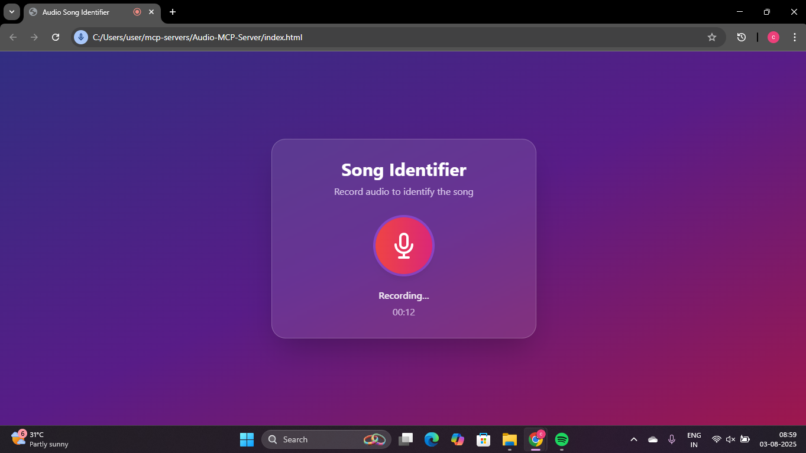
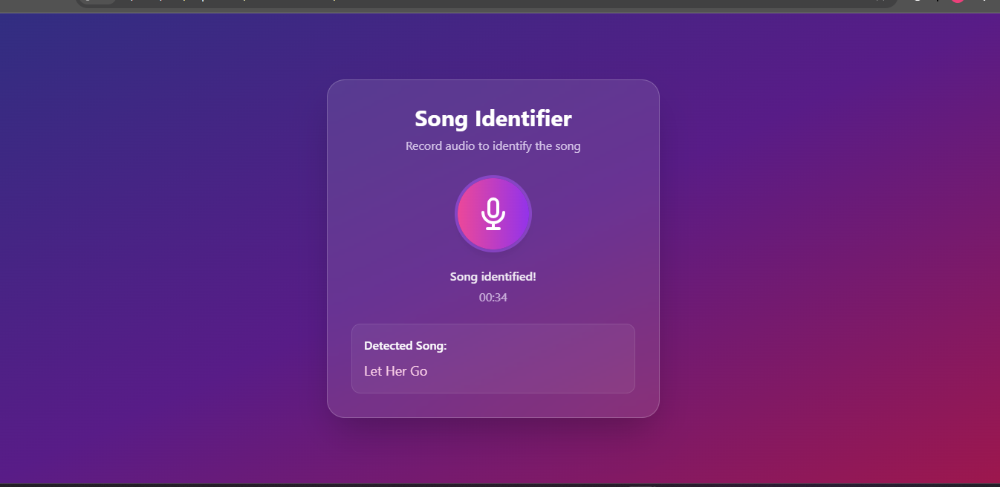

# 🎵 Song Recognition Project (Shazam-like Local MCP Server)

This project is a **local Shazam-like song recognition system** that identifies songs without using any external APIs.  
It uses:

- **Node.js MCP Server** to process and identify songs.
- **Python (Librosa + NumPy)** to extract MFCC fingerprints.
- **FFmpeg** for audio format compatibility.

---

## **Features**
- 🎤 Record short audio clips from the browser.
- 🧠 Generate MFCC fingerprints using Python.
- 🔎 Compare recordings with a local songs database.
- 📡 Fully **offline** using **MCP Server**.
- ❌ **No external APIs required**.

---

## 📂 Project Structure

Song-recognition-project/

    │── fingerprint.py    # Extracts MFCC fingerprints (Qwencoder-assisted)
    
    │── generate_db.py     # Generates songs.json database locally
    
    │── index.html         # Frontend UI with MediaRecorder
    
    │── index.js           # Node.js server (MCP server for recognition)
    
    │── songs/             # Your local song library
    
    │── uploads/           # Temporary audio recordings
    
    │── songs.json         # Auto-generated database of song fingerprints
    
    │── screenshots/       # Proof of execution screenshots

## **Workflow**
1. **Frontend** (index.html)
   - User records audio using **MediaRecorder API**.
2. **MCP Server (index.js)**
   - Receives uploaded audio.
   - Calls **fingerprint.py** to extract MFCC features.
   - Compares features with **songs.json**.
3. **Output**
   - Returns the best match (e.g., *"Baby"* or *"Believer"*).

**Sample Logs:**

    Server running at http://localhost:3000
    
    --- New Identification Request ---
    Similarity with "Baby": 0.9423
    Similarity with "Believer": 0.8236
    Best match: Baby, Similarity: 0.9423

**1.Install Dependencies**

Node.js (Backend MCP Server)

    npm install express multer cors
Python Requirements

    pip install -r requirements.txt

Install FFmpeg

* Download from Gyan.dev.

* Extract and add bin folder to PATH (e.g., C:\ffmpeg\bin).

**2.Generate Song Database**

Place your .mp3 songs in the songs/ folder.

    python generate_db.py
This creates songs.json with fingerprints

**3.Start MCP Server**

    node index.js
Server runs at:

    http://localhost:3000

**5. Run Frontend**
* Open index.html in your browser.

* Click Record, hum or play a song.

* Server returns the best match.

## 📸 Proof of Execution

Here’s an example of successful song detection:

### Recording Interface

### Song Detected

## Acknowledgements

* Qwencoder AI Agent – Assisted in writing and structuring the Python and Node.js code for local audio fingerprinting and MCP server integration.

* MCP Server – Used for handling local audio recognition workflow.

* Librosa, NumPy, FFmpeg – Used for extracting MFCC features and processing audio
